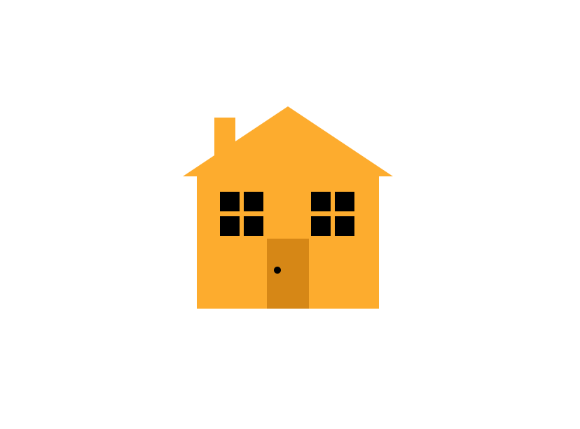

# House using HTML and CSS

Requiremetes:

1. Should have flexbox windows tiles.

2. Should have Isosceles or Equilateral Triangle as a roof.

3. should have a rectangular door with a circular handle.

&nbsp;
